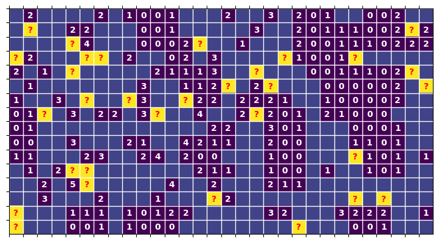

# MinesweeperLearning
Learning to play Minesweepr with Neural Networks

## Game

The repo provide pyhton utils to generate, plot and play minesweeper games through code.

## Models

The repo also contain various models definition and their trained weights, and general utilities to train minesweeper models.

See simple examples of the api use in [test.ipynb](test.ipynb)

## Plots

|  | 
|:--:| 
| *Plot with predicted probabilities and last opened cells highlighted in red* |

|  | 
|:--:| 
| *Game state plot* |

